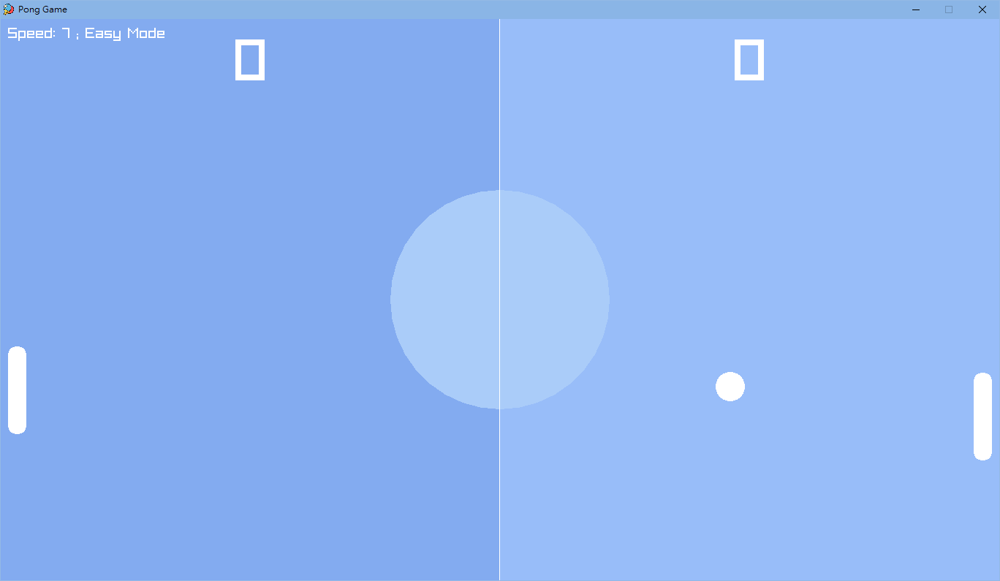
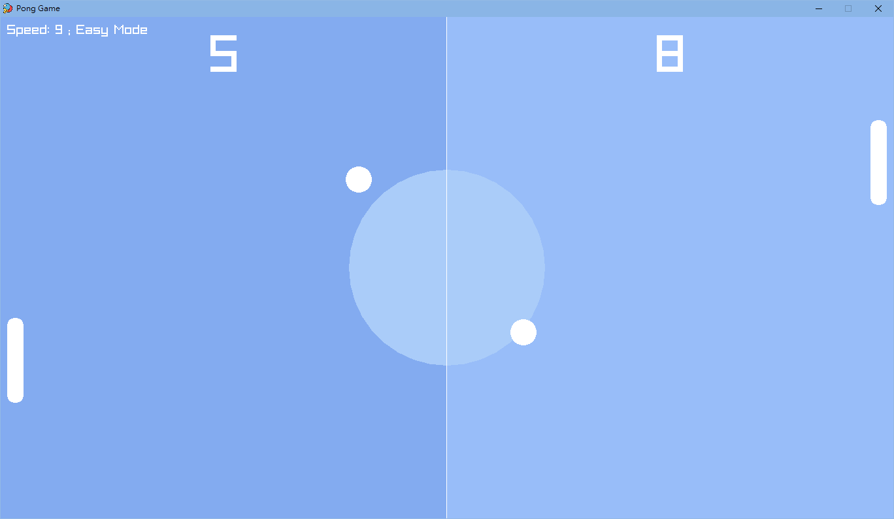
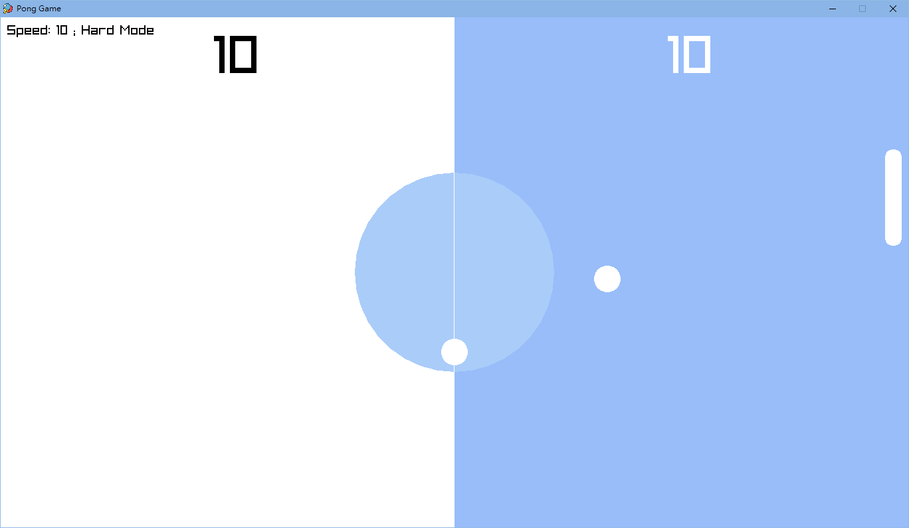
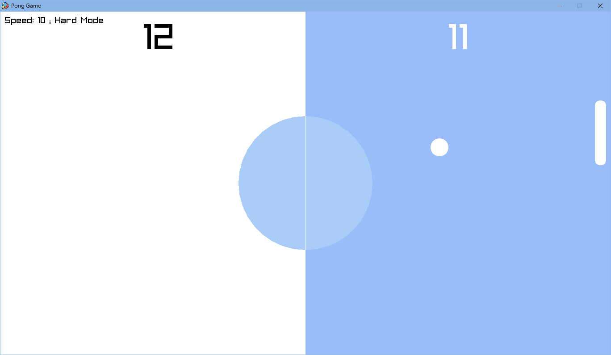

# 乒乓球遊戲 🏓

此專案於 2023 年 7 月製作

本專案為一款經典的乒乓球遊戲，玩家將與 AI 對抗。當球擊中對手的邊界時，玩家就會得分。與傳統版本不同，隨著得分增加，遊戲的速度和難度也會相應提升。

## 專案截圖 🖥

### 遊戲介面

### 雙球模式

### 困難模式

## 使用技術 🔧

- **C++**：進行遊戲邏輯和界面開發

- **Raylib**：一個簡單易用的 C 語言遊戲庫，本專案使用許多 Raylib 提供之 API 進行開發

- **物件導向程式設計**：此遊戲透過物件導向方式撰寫、組織程式碼

## 功能 🚀

- **動態玩法**：隨著玩家或 AI 分數越高，遊戲會通過調整球拍大小、球速來增加難度

- **AI 對手**：與電腦控制的球拍競爭，其移動會根據球的位置進行調整

- **計分系統**：記錄玩家與 AI 的得分

- **雙球模式**：當玩家或 AI 的得分達到 5 分或以上時，將有第二個球進入遊戲，增加額外的挑戰

- **困難模式**：遊戲從「簡單模式」開始，當任一玩家達到 10 分將切換至「困難模式」

## 執行方式  🏃

1. 確保已安裝 `raylib`

2. 編譯並執行 C++ 檔案

3. 使用鍵盤 `UP` 和 `DOWN` 方向鍵來控制球拍

4. 按下 `ESC` 或 `ENTER` 退出遊戲

## 圖示來源 🌟

[Ping pong icons created by Freepik - Flaticon](https://www.flaticon.com/free-icons/ping-pong)